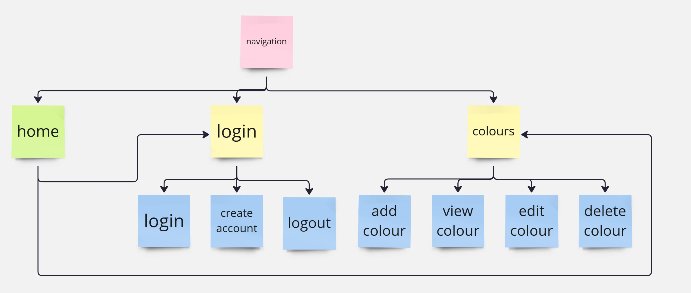
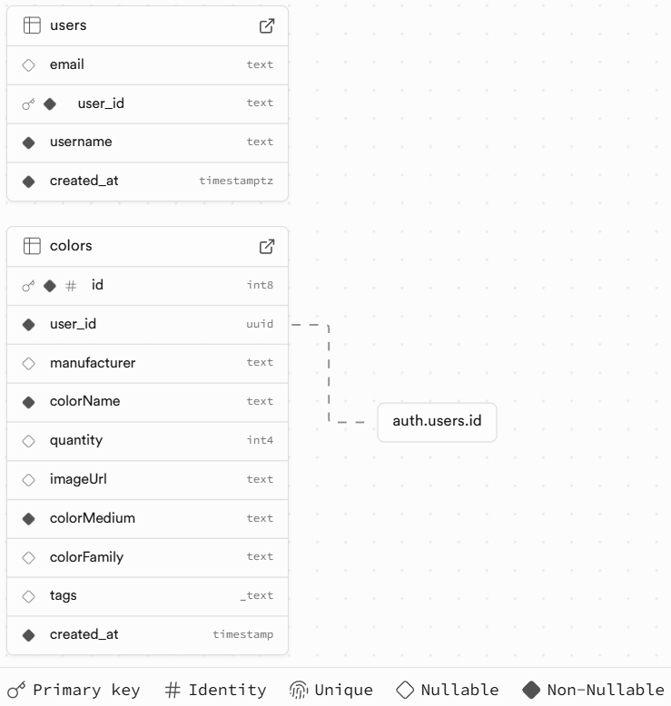
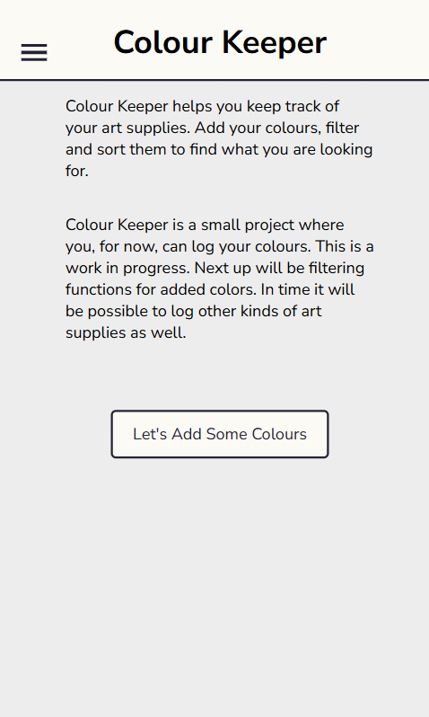
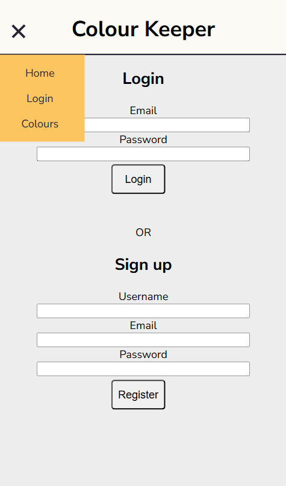
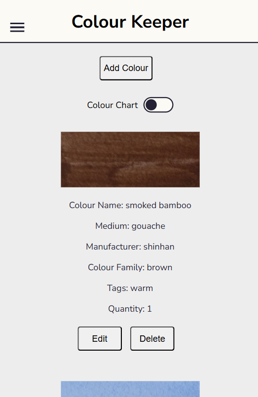
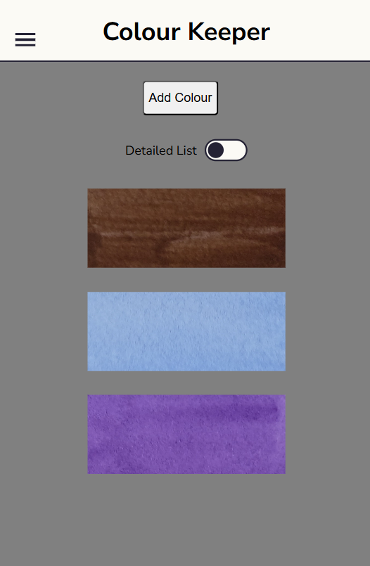
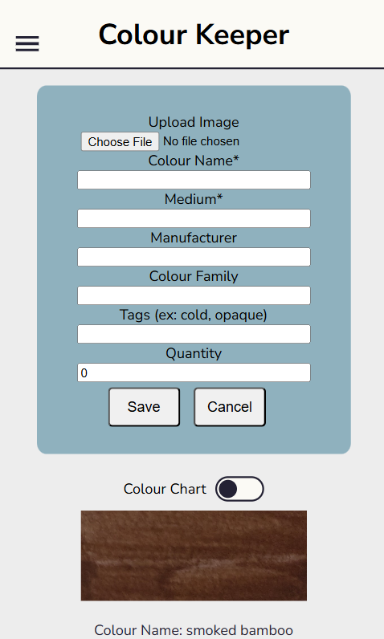
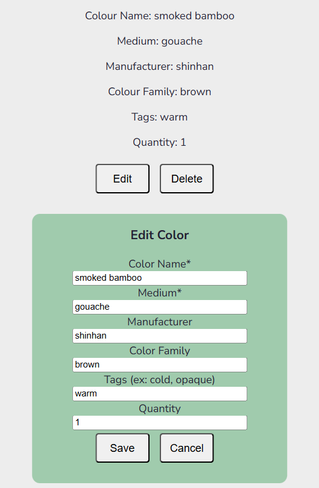

# Colour Keeper
Colour Keeper is my higher vocational degree project in frontend development at Medieinstitutet.  
  
The idea was to build an application, Colour Keeper, where users can log their art supplies. Specifically, they can freely log the different colours they own. The purpose of Colour Keeper is to have an overview of the supplies in order to  facilitate the planning of art projects and the purchase of new art supplies.  
  
The application is scalable, meaning that it can be expanded to include other types of art supplies such as brushes or paper.  
  
The app is fully functional as is. New features, such as filtering, will be added with time.  

## Content  
- Stack  
- Installation and Running Project  
- Flow Chart and Database Schema  
- Screenshots  

## Stack  
HTML | CSS | Sass | JavaScript | TypeScript | React | Vite  
Supabase | PostgreSQL  

## Installation and Running Project 
#### Vite, React, TypeScript
npm create vite@latest  
  
npm run dev
#### Supabase 
npm install @supabase/supabase-js

## Flow Chart and Database Schema  

## Screenshots  

  

  

  

  

  

  
